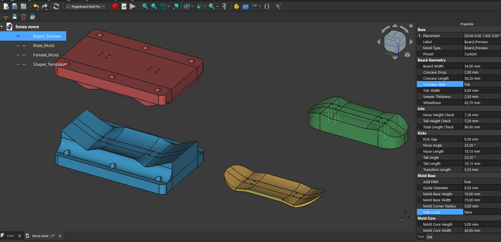

# Fingerboard Mold Pro

A professional parametric workbench for FreeCAD, designed to generate high-precision molds for **fingerboarding** (miniature skateboarding).

It allows makers to generate organic, customizable 3D-printable molds used to press and shape wooden veneers into finished fingerboard decks.

## 🚀 Key Features
* **Loft & Bezier Engine**: Generates organic shapes and fluid transitions (no simple geometric arcs).
* **Fully Parametric**: Every dimension (wheelbase, kick height, concave depth) is adjustable in real-time.
* **Full Layout**: Automatically generates 4 objects in the scene (Deck, Male Mold, Female Mold, Template) positioned for an immediate overview.
* **Presets System**: Save your best shapes as JSON presets and reload them instantly.
* **Batch Export**: Automatically exports all necessary STL files (Male, Female, Template) with a single click.

### v1.2 Update: New Geometry Engine
- **True Radius Kicks:** The kick geometry is now calculated using a precise radius derived from the Transition Length. No more "wavy" splines; kicks are crisp and defined.
- **Tub Concave:** Added `TubWidth` parameter to create a flat central section with curved sides (modern street shape).
- **Side Printing Prep:** Added `AddFillet` (Bool). Set to `False` to remove the base fillet, making it easier to print the mold on its side without supports.
- **Fix:** Fixed center "belly" issue in the concave profile.

---

## 📦 Installation

Since this workbench is not yet available in the official Addon Manager registry, please install it manually:

1. **Download** this repository as a ZIP file and extract it.

2. **Locate your FreeCAD Addon folder**:
    * Open FreeCAD and launch the **Addon Manager**
    * **Ensure your Addon Manager is up to date**.
    * Click on the **"Open Addon Folder"** option:

3. **Copy** the extracted `FingerboardMoldPro` folder into that directory you just opened.

4. **Restart FreeCAD** to load the new workbench.

---

## 📖 User Guide

### 1. Core Concept: The "Master" and the "Slaves"
When you create a new mold, **4 objects** will appear in the project tree:

1.  **`Board_Preview` (THE MASTER)**: This is the finished deck in the center. **This is the ONLY object you need to modify.** It holds all the parameters (dimensions, angles, etc.).
2.  `Male_Mold`: The positive mold block (blue).
3.  `Female_Mold`: The negative mold block (red).
4.  `Shaper_Template`: The cutting guide (green transparent).

**⚠️ Important:** The Male, Female, and Template objects are linked to the Master. If you want to change the length or wheelbase, **always modify `Board_Preview` only**. The others will update automatically.

### 2. Step-by-Step Workflow
1.  **Select the Workbench**: Choose "Fingerboard Mold Pro" from the dropdown menu.
2.  **Create**: Click the **New Mold** icon (Yellow Deck icon). The 4 objects will appear in the 3D view, spaced apart to avoid overlapping.
3.  **Edit Parameters**:
    * Select the **`Board_Preview`** object in the tree.
    * Go to the **Data** tab in the Property View (bottom left).
    * Change values (e.g., `Wheelbase`, `NoseAngle`, etc.) and press **Enter**.
    * You will see all 4 objects update simultaneously with the new measurements.
4.  **Visualization**:
    * There is no need to switch views or toggle visibility: you always have a full overview of how the Male and Female molds fit the deck geometry.

### 3. Using Presets
Don't want to re-enter your numbers every time?
* **Save**: Select the Master (`Board_Preview`), click the **Save Preset** icon (Floppy disk), and give it a name.
* **Load**: Select the Master. In the Data Tab, find the **`Preset`** dropdown and select your saved preset.

### 4. Exporting for 3D Printing (STL)
1.  Select the **`Board_Preview`** object.
2.  Click the **Export Batch STL** icon (Green arrow).
3.  Choose a destination folder.
4.  The script will automatically generate individual files for printing:
    * `YourBoardName_Male_Mold.stl`
    * `YourBoardName_Female_Mold.stl`
    * `YourBoardName_Shaper_Template.stl`

---

## 🎛️ Parameters Glossary (Data Tab)

### Board Geometry
* **BoardWidth**: The maximum width of the deck.
* **Wheelbase**: Distance between truck holes (inner to inner).
* **ConcaveDrop**: Depth of the concave in mm.
* **ConcaveLength**: Length of the flat section of the concave.

### Kicks (Nose & Tail)
* **NoseAngle / TailAngle**: The kick angle in degrees.
* **NoseLength / TailLength**: Length from the outer truck holes to the tip.
* **TransitionLength**: Distance used to blend the flat part into the kick.
* **TransitionSmoothness**: Controls the curvature of the transition (higher = smoother/more organic).

### Shaper
* **NoseShape / TailShape**: Pre-defined shapes (Popsicle, Boxy, etc.).
* **TaperStart**: Point where the width starts to narrow towards the tip.
* **Flatness**: Shape of the tip (0 = Pointy, 100 = Square).

---

## License
This workbench is licensed under the **LGPLv2.1** (same as FreeCAD).  

---

## Warning: 
Using this software may cause an uncontrollable urge to sand tiny pieces of wood at 3 AM.